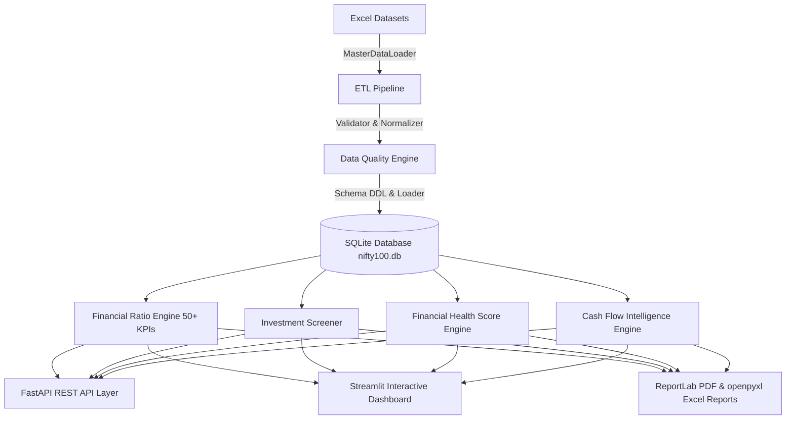

# Bluestock Nifty 100 Financial Intelligence Platform — Architecture

## System Architecture Diagram

## Core Components
- **Data Engineering Layer**: Ingests Excel datasets, normalizes tickers (`HDFCBANK`), standardizes financial years (`FY24`), and logs Data Quality audits to `outputs/validation_failures.csv` and `outputs/load_audit.csv`.
- **Relational Database**: SQLite `nifty100.db` with 12 normalized tables, composite primary/foreign keys, and indexes on sector and company identifiers.
- **Financial Analytics Engine**: Computes 50+ financial KPIs, transparent 0–100 Financial Health Scores, peer benchmarking percentiles (0–100), and 8-pattern cash flow allocation matrices.
- **FastAPI REST API**: 16 OpenAPI endpoints providing programmatic access to companies, ratios, screeners, peer comparisons, and PDF tear sheet downloads.
- **Streamlit Dashboard**: Multi-page interactive application featuring 8 dedicated analytical screens.
